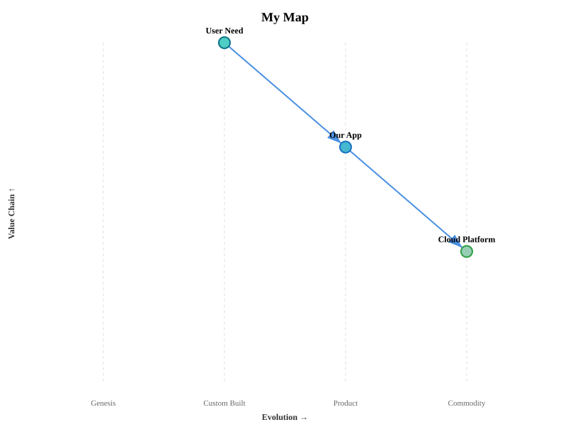
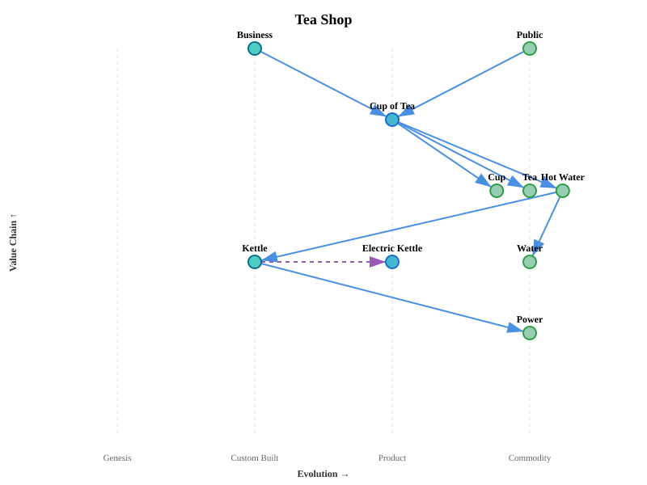
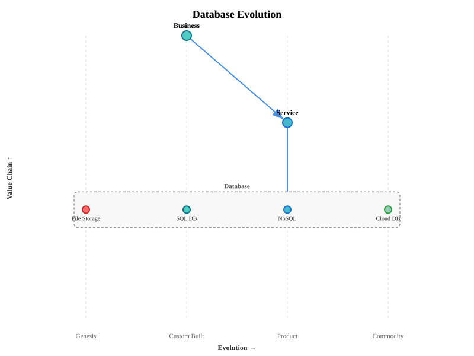

# Wardley Map Simple - Obsidian Plugin

[](https://github.com/BlockSecCA/wardley_map_simple_obsidian_plugin/releases)
[](LICENSE)
[](src/)
[](https://obsidian.md)
[](test.mts)

Create Wardley Maps in Obsidian using declarative syntax. No coordinates, no manual positioning: describe your components and dependencies, and the plugin handles the layout.

## Installation

1. Download the latest release ZIP from GitHub
2. Extract `main.js`, `manifest.json`, and `styles.css` into your vault at `.obsidian/plugins/wardley-map-simple/`
3. In Obsidian: Settings > Community Plugins > Reload > Enable "Wardley Map Simple"

## Quick Start

Create a fenced code block with language `wardley`:

````markdown
```wardley
title My Map

anchor User Need [custom]
component Our App [product]
component Cloud Platform [commodity]

User Need -> Our App -> Cloud Platform
```
````



The plugin renders the map automatically. Components are positioned by evolution stage (X-axis) and dependency depth (Y-axis).

## Syntax Reference

### Components and Anchors

```
component Name [stage]              # regular component
component Name [stage] (strategy)   # with source strategy
anchor User Need [stage]            # user need (always at top)
```

**Evolution stages** (X-axis, left to right):
- `genesis` -- novel, uncertain (red)
- `custom` -- custom-built (teal)
- `product` -- standardized (blue)
- `commodity` -- utility (green)

**Source strategies** (optional): `build`, `buy`, `outsource`, `market`

### Dependencies

```
A -> B                  # A depends on B
A -> B -> C -> D        # chain notation
A -> B; some label      # with annotation
```

### Evolution

```
evolve Old -> New [product]     # component-to-component (dashed purple arrow)
evolve Component [product]      # evolve to stage (rightward arrow at same Y)
```

### Inertia

```
inertia ComponentName           # vertical bar indicating resistance to change
```

### Flow Arrows

Flow arrows are distinct from dependencies (rendered in orange):

```
A +> B                  # forward flow
A +< B                  # backward flow
A +<> B                 # bidirectional flow
A +> B; label           # with annotation
```

### Pipelines

A component containing sub-components at different evolution stages, rendered as a horizontal box:

```
component Database [product]

pipeline Database
  component File Storage [genesis]
  component SQL DB [custom]
  component NoSQL [product]
  component Cloud DB [commodity]
```

Sub-components must be indented (2 spaces or tab). The pipeline block ends at the next non-indented or empty line.

### Metadata

```
title Map Title                 # optional title
annotation 1 Some insight       # numbered annotation (bottom of map)
note General observation        # note text
# this is a comment             # comments are ignored
```

## Examples

### Tea Shop (Classic Wardley Map)

````markdown
```wardley
title Tea Shop

anchor Business [custom]
anchor Public [commodity]

component Cup of Tea [product]
component Cup [commodity]
component Tea [commodity]
component Hot Water [commodity]
component Water [commodity]
component Kettle [custom]
component Electric Kettle [product]
component Power [commodity]

Business -> Cup of Tea
Public -> Cup of Tea
Cup of Tea -> Cup
Cup of Tea -> Tea
Cup of Tea -> Hot Water
Hot Water -> Water
Hot Water -> Kettle
Kettle -> Power

evolve Kettle -> Electric Kettle [product]
```
````



User needs (Business, Public) at the top, value chain flowing downward to infrastructure (Power), components color-coded by evolution stage, evolution arrow from Kettle to Electric Kettle.

### Database Pipeline

````markdown
```wardley
title Database Evolution

anchor Business [custom]
component Service [product]
component Database [product]

pipeline Database
  component File Storage [genesis]
  component SQL DB [custom]
  component NoSQL [product]
  component Cloud DB [commodity]

Business -> Service
Service -> Database
```
````



The pipeline box shows Database existing across multiple evolution stages simultaneously, from File Storage (genesis) through to Cloud DB (commodity).

More examples in the [`examples/`](./examples/) folder.

## How the Layout Works

- **X-axis (Evolution)**: Components are placed in their stage band (genesis, custom, product, commodity)
- **Y-axis (Value Chain)**: Computed from dependency depth. Anchors at the top, deepest dependencies at the bottom. No manual coordinates needed.
- **Overlap prevention**: Components at the same depth and stage are spread horizontally, ordered by their connections to reduce edge crossings

## Theming

The plugin uses CSS custom properties. Override them in an Obsidian CSS snippet:

```css
.wardley-map-container {
  --wardley-genesis-fill: #FF6B6B;
  --wardley-custom-fill: #4ECDC4;
  --wardley-product-fill: #45B7D1;
  --wardley-commodity-fill: #96CEB4;
  --wardley-bg: white;
}
```

All SVG elements have semantic CSS classes (`wardley-node`, `wardley-edge`, `wardley-pipeline`, etc.) for fine-grained styling.

## Development

```bash
npm install
npm run build       # type-check + bundle
npm test            # 65 tests (parser, layout, renderer, backward compat)
npm run dev         # watch mode
```

**Project structure:**
- `src/` -- TypeScript source (parser, renderer, types, plugin entry)
- `examples/` -- sample Wardley Map definitions with SVG output
- `tools/` -- standalone SVG generator and validators
- `test.mts` -- test suite (Node built-in test runner)

## Syntax and OWM

This plugin's syntax is inspired by [OnlineWardleyMaps (OWM)](https://onlinewardleymaps.com/) and supports the same Wardley elements (components, anchors, pipelines, inertia, flows, evolution). However, it deliberately uses **named evolution stages** (`genesis`, `custom`, `product`, `commodity`) instead of OWM's numeric coordinates (`[visibility, evolution]`). The layout is computed automatically from the dependency graph, so you never need to specify positions.

For the OWM DSL reference, see the [OWM documentation](https://docs.onlinewardleymaps.com/docs/dsl-reference/).

No code is shared with OWM or [Mermaid's Wardley Maps implementation](https://github.com/mermaid-js/mermaid/pull/7147). The parser and renderer are built from scratch for Obsidian.

## Credits

Wardley Mapping methodology by [Simon Wardley](https://wardleymaps.com/). Learn more: [Wardley Maps book](https://medium.com/wardleymaps) (free online).

## License

MIT

## Author

Carlos - BlockSecCA
